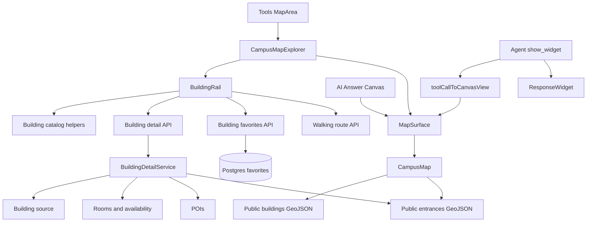

# Design Document: Campus Map Explorer

## Overview

Campus Map Explorer turns the Tools version of Campus Map into a two-region building discovery workspace. A fixed 20rem Building Rail supports search, a curated eight-building starting list, account favorites, selected-building details, actions, room and service data, and an editable two-endpoint directions flow. The existing inset map remains the main canvas. At compact workspace widths, the map stays visible while the same Explore rail becomes a non-modal bottom sheet; selecting a footprint expands its details without remounting WebGL.

AI mode continues to render the map without the Tools rail. Existing building, route, places, and parking widgets remain backward compatible. Three additive widget types expose comprehensive building details, verified entrances, and building spaces from an exact code already resolved by the agent. Response widgets drive map highlight state and entrance visibility without mounting Tools-only controls.

The implementation treats repository data as evidence. It uses official building identifiers for rooms and entrances, labels spatially contained POIs as location-derived, shows room availability with snapshot freshness, and excludes undocumented entrance flags, inferred departments, measured-popularity claims, expired image URLs, and heuristic event or people associations. No new runtime dependency is required.

### Research findings

- The building source contains 449 current footprints with official code, name, short name, primary address, postal code, height, floor count, usage, state, construction, area, management, and condition fields.
- The entrance source contains 1,474 points. A total of 1,360 current entrances join to 380 buildings through official building identifiers. Entrance rotation and numeric accessibility semantics lack source documentation, so marker orientation must come from footprint geometry and accessibility labels remain neutral.
- Learning Spaces contains 411 rooms in 50 buildings. Library booking data contains 51 rooms and 1,062 dated availability intervals across five buildings. Availability represents a snapshot, not live occupancy.
- Direct joins cover rooms and entrances. POIs can join through official addresses or spatial containment. Events, people, food, departments, and whole-building hours lack dependable building keys.
- The data has no popularity signal. The initial eight-building list is product-curated and labeled as such.
- Learning-space attachment URLs expire. New photo UI accepts only durable allowlisted UBC or official service URLs and keeps source links when an image cannot render.
- Existing map state, public data APIs, building popup details, account persistence, and agent widget rendering already provide reusable seams, but current map data endpoints reject guest access and current building details expose only rooms, POIs, and library-room snapshots.

## Architecture



### Host separation

`MapArea` remains the registry-facing component. `useWorkspaceHost` and shell mode select one of two compositions:

- **Tools**: `CampusMapExplorer` renders `WorkspacePage` with `composition="split"`, a `WorkspacePanel` rail, and a `WorkspaceCanvas` map.
- **AI Answer Canvas**: `MapSurface` renders directly and retains the existing transient building popup for manual map clicks. `CampusMapExplorer` and account favorites never mount.

This keeps one map renderer and one layer pipeline. Tools controls live outside `CampusMap`; AI map widgets alter only map state.

### Data flow

1. `MapSurface` loads sanitized public building GeoJSON. `CampusMapExplorer` reuses the API client's fulfilled promise to derive the local Building Catalog without a second network request.
2. Tools search runs synchronously against the local catalog. Selecting a row or footprint updates one controlled `SelectedBuilding` value and the `building` URL search parameter.
3. The selected code starts an abortable Building Record request. A request generation guard prevents an older response from replacing a newer selection.
4. `BuildingRail` renders base identity immediately and fills source sections as the record resolves. Source-status metadata distinguishes empty sections from unavailable sections.
5. Favorite state loads only for authenticated users. Save and remove use one idempotent endpoint and roll back optimistic UI on failure.
6. Entrance GeoJSON loads through the public map API. Pure entrance geometry helpers project verified entrance points to nearby footprint edges. `CampusMap` renders resulting ground arrows and door outlines only for a selected building or at zoom level 16 and above.
7. In-app directions expose editable From and To boxes backed by one transient catalog listbox. Selecting a result commits that endpoint, removes the query/results immediately, and sends both official codes to the route API when available. Valid network results lift the pedestrian polyline slightly above flat ground. A single 30%-opacity primary stroke renders fragments behind scene geometry; a full-opacity casing and primary trace render visible fragments. Route passes do not write depth, opaque buildings retain normal depth comparison and writes, and basemap labels remain on top. Estimate results show labeled distance text without drawing a straight route line.
8. AI `show_widget` results map into the same `MapHighlight` union. The existing `building` contract keeps its input and result shape; `building_detail`, `building_entrances`, and `building_spaces` accept one exact resolved building code. Building entrances set an entrance-display flag; building spaces highlight the building while the Chat card carries room details.

## Components and Interfaces

### Component 1: CampusMapExplorer

**Purpose**: Own the Tools-only split workspace and synchronize rail, map, URL, compact sheet, catalog, details, route, and favorites state.

**Interface**:

```typescript
interface CampusMapExplorerProps {
  initialHighlight: MapHighlight | null;
  focusNonce: number;
}
```

**Responsibilities**:

- Render `WorkspacePage` with one map-specific wrapper that changes only the compact presentation.
- Preserve both regions while the compact Explore sheet expands and collapses.
- Parse and write the `building` search parameter without remounting the map.
- Store the prior query and rail scroll position when details open.
- Abort stale detail requests and keep base building identity visible during loading.
- Coordinate selected building, favorite state, directions state, and map focus.
- Expand compact Explore after a footprint click, collapse it to a route-summary handle after a valid network route succeeds, and keep malformed or estimated routes in the sheet.

### Component 2: BuildingRail

**Purpose**: Present building discovery, details, and editable route endpoints inside one bounded `WorkspacePanel`.

**Interface**:

```typescript
type BuildingRailMode =
  | { kind: "discover"; query: string }
  | { kind: "details"; building: BuildingSummary }
  | {
      kind: "directions";
      origin: BuildingSummary | null;
      destination: BuildingSummary;
      editing: "origin" | "destination" | null;
      query: string;
    };

interface BuildingRailProps {
  mode: BuildingRailMode;
  catalog: BuildingSummary[];
  popular: BuildingSummary[];
  favorites: ReadonlySet<string>;
  favoriteStatus: "loading" | "ready" | "saving" | "error";
  authenticated: boolean;
  details: BuildingDetailsState;
  route: RouteState;
  onQueryChange(query: string): void;
  onSelect(building: BuildingSummary): void;
  onBack(): void;
  onDirections(): void;
  onRouteEndpointSelect(endpoint: "origin" | "destination", building: BuildingSummary): void;
  onRetryRoute(): void;
  onToggleFavorite(code: string): void;
  onSignIn(): void;
  onShare(): void;
  onOpenGoogleMaps(): void;
}
```

**Responsibilities**:

- Keep one fixed search field in discovery, place icon-only parent-return actions immediately before the Building details and Directions panel headings, and reserve the raised route card for two equal shared `TextInput` compact controls after a 16px marker track with a 12px gutter.
- Keep the endpoint grid sticky inside the single bounded directions scroll owner; contain overscroll and preserve native vertical wheel and touch panning from both editor and result rows.
- Render Saved before Curated popular buildings when favorites exist.
- Use rounded endpoint-specific result rows with familiar icon tiles, inset active state, listbox keyboard semantics, and immediate removal after selection.
- Render task-relevant non-empty fields through explicit detail sections and omit physical property, construction, condition, occupancy, and management metadata.
- Provide labeled Directions, Share, Save, and Open in Google Maps actions.
- Identify curated popularity, spatial POI joins, room snapshot freshness, and source failures.
- Omit empty sections rather than rendering placeholder cards.

### Component 3: Building detail presentation

**Purpose**: Share detail section rendering between the Tools rail, AI building Response Widget, and the existing AI map popup without duplicating field logic.

**Interface**:

```typescript
interface BuildingDetailContentProps {
  building: BuildingSummary;
  details: BuildingDetailsState;
  density: "rail" | "popup" | "widget";
  sections?: BuildingSectionKey[];
}
```

**Responsibilities**:

- Map each `BuildingDetails` field to one labeled section.
- Keep the Tools action bar outside reusable content.
- Use room and POI image records only after URL-source validation.
- Keep source links when a remote image fails.
- Render retry controls for unavailable source sections while preserving successful sections.

### Component 4: CampusMap

**Purpose**: Render building, route, POI, entrance, and label layers while supporting controlled Tools selection and uncontrolled AI popup selection.

**Interface**:

```typescript
interface CampusMapProps {
  highlight: MapHighlight | null;
  focusNonce: number;
  showRoutes: boolean;
  entrances: EntranceFeatureCollection | null;
  selectedBuilding?: BuildingSummary | null;
  onBuildingSelect?(building: BuildingSummary | null): void;
  showBuildingPopup?: boolean;
  onStatus?(status: MapStatus): void;
  controls?: React.RefObject<MapControls | null>;
}
```

**Responsibilities**:

- Use controlled selection when `onBuildingSelect` exists; retain cached internal selection for AI mode.
- Frame a selected building without mutating agent highlight state.
- Build entrance markers once per building/entrance collection pair.
- Render valid entrance markers for selected buildings and at high zoom.
- Preserve the existing basemap, route, labels, camera cache, map status, and reduced-motion behavior.
- Keep map footprint clicks as the only building selection gesture.
- Expose `resize()` through `MapControls` and call it from a `ResizeObserver` when the mounted map surface changes size.

### Component 5: Building catalog helpers

**Purpose**: Convert sanitized building features into deterministic searchable summaries and encode shareable selection.

**Interface**:

```typescript
export function buildingsFromGeoJson(collection: FeatureCollection): BuildingSummary[];
export function searchBuildings(catalog: BuildingSummary[], query: string, limit?: number): BuildingSummary[];
export function popularBuildings(catalog: BuildingSummary[]): BuildingSummary[];
export function parseBuildingParam(value: string | null, catalog: BuildingSummary[]): BuildingSummary | null;
export function formatBuildingUrl(base: URL, code: string): URL;
```

**Responsibilities**:

- Generate the same acronym aliases used by server building resolution.
- Normalize codes and text without locale-dependent ordering.
- Rank exact code, exact alias, prefix, and substring matches in that order.
- Cap search output at 20 and remove duplicate codes.
- Validate all curated popular codes against the loaded catalog.
- Round-trip selected building codes through URL search parameters.

### Component 6: Entrance geometry helpers

**Purpose**: Derive renderable arrows and door outlines from verified point and footprint geometry without treating undocumented source rotation as fact.

**Interface**:

```typescript
export function buildEntranceMarkers(
  buildings: FeatureCollection,
  entrances: EntranceFeatureCollection,
  maxWallDistanceMeters?: number,
): EntranceMarker[];
```

**Responsibilities**:

- Join entrance points to building summaries by official building code.
- Search every exterior and courtyard boundary ring in Polygon and MultiPolygon footprints.
- Find the nearest ring segment in local metre coordinates and accept projections no farther than 4 metres from the verified point.
- Determine the side outside the polygon material with point-in-polygon checks.
- Point the ground arrow from the non-building side toward the verified entrance.
- Build a vertical door outline on the matched wall plane with width along the wall tangent and height along altitude; use less-equal depth comparison, no depth writes, and `[-1, -1]` rasterization depth bias to avoid z-fighting without exposing a physical gap.
- Skip malformed or ambiguous geometry instead of falling back to source rotation.

### Component 7: Building detail loader

**Purpose**: Assemble one public-safe Building Record and source-status metadata through a concrete server helper reused by HTTP and widgets.

**Interface**:

```typescript
export async function loadBuildingDetails(
  search: SearchClient,
  code: string,
  now: Date,
): Promise<BuildingDetails>;
```

**Responsibilities**:

- Resolve the official building code and select one sanitized footprint record.
- Expose documented building fields with section-level provenance.
- Join learning spaces and library rooms through official building code.
- Join entrance records through official building identifier.
- Join POIs through official address where available and otherwise through spatial containment marked `location-derived`.
- Validate photo source and URL durability before returning an `OfficialPhoto`.
- Report independent source status instead of collapsing partial failures into empty arrays.
- Exclude fields and joins whose semantics cannot be supported from source metadata.

### Component 8: Public map API extensions

**Purpose**: Extend the existing `ChatApi` with public campus reads while keeping account state authenticated.

**Interface**:

```typescript
interface ChatApi {
  getGeo(name: "buildings" | "walking-routes" | "entrances"): Promise<FeatureCollection>;
  getBuildingDetails(code: string, signal?: AbortSignal): Promise<BuildingDetails>;
  getRoute(from: string, to: string, signal?: AbortSignal): Promise<RouteResponse>;
  getBuildingFavorites(): Promise<string[]>;
  setBuildingFavorite(code: string, saved: boolean): Promise<string[]>;
}
```

**Responsibilities**:

- Return allowlisted building and entrance properties rather than raw source records.
- Stream static walking paths and return sanitized JSON for transformed artifacts.
- Permit public reads for map catalog, detail, entrance, and route requests.
- Preserve authentication for account favorites and all private account APIs.
- Accept abort signals from selection changes.

The existing `GeoArtifact` contract gains an optional loader for sanitized or joined collections. File-backed walking routes retain the existing stream path; buildings and entrances use loaders.

### Component 9: Favorite store

**Purpose**: Persist a set of official building codes per account through concrete store functions.

**Interface**:

```typescript
export async function listBuildingFavorites(userId: string): Promise<string[]>;
export async function setBuildingFavorite(userId: string, buildingCode: string, saved: boolean): Promise<string[]>;
```

**Responsibilities**:

- Store one `(user_id, building_code)` row per favorite.
- Apply save with conflict-ignore and remove with a user-qualified delete.
- Return codes ordered by most recent save time.
- Validate building codes at the authenticated API boundary.
- Keep guest state out of browser storage.

### Component 10: Agent map widgets

**Purpose**: Extend `show_widget`, Chat cards, and canvas mapping for richer building map answers without changing stored `building` widgets.

**Interface**:

```typescript
type RichMapWidgetType = "building_detail" | "building_entrances" | "building_spaces";

interface RichBuildingWidgetResult {
  type: RichMapWidgetType;
  result: BuildingDetails;
}
```

**Responsibilities**:

- Preserve the existing `building` input and `BuildingDoc` result for saved Chat history.
- Add `building_detail`, `building_entrances`, and `building_spaces` types with one `building_code` input already returned by `find_building`.
- Reuse `loadBuildingDetails` rather than duplicate joins in the widget executor.
- Map all three additive results to one building highlight; entrance widgets set `showEntrances`.
- Render section-aware Chat summaries and retain raw fallback on renderer failure.
- Update agent recipes and human-readable tool labels in the same unit.

## Data Models

### BuildingSummary

```typescript
interface BuildingSummary {
  code: string;
  name: string;
  shortName: string | null;
  aliases: string[];
  address: string | null;
  postalCode: string | null;
  usage: string | null;
  state: string | null;
  floors: number | null;
  heightMeters: number | null;
  centroid: [longitude: number, latitude: number];
}
```

**Validation Rules**:

- `code` is non-empty, uppercase, and unique within the catalog.
- `centroid` contains finite WGS84 coordinates.
- Numeric values are finite and non-negative.
- Search normalization derives from public names and addresses only.

### BuildingDetails

```typescript
type SourceState = "ready" | "unavailable";
type DataAssociation = "direct" | "official-address" | "location-derived";
type Freshness = "current" | "historical" | "unknown";

interface DataProvenance {
  sourceName: string;
  refreshedAt: string | null;
  association: DataAssociation;
}

interface OfficialPhoto {
  url: string;
  alt: string;
  sourceUrl: string;
  sourceName: string;
  classification: "ubc-hosted" | "official-service" | "reodite-owned";
}

interface SourceSectionStatus {
  state: SourceState;
  provenance: DataProvenance;
}

interface BuildingDetails {
  building: BuildingSummary & {
    secondaryUsage: string | null;
    neighbourhood: string | null;
    jurisdiction: string | null;
    propertyType: string | null;
    hasSubbuildings: boolean | null;
    managingOrganization: string | null;
    maintenanceOrganization: string | null;
    constructionStatus: string | null;
    constructionType: string | null;
    occupancyDate: string | null;
    grossAreaSquareMeters: number | null;
    form: string | null;
    condition: string | null;
    greenStatus: string | null;
  };
  addresses: BuildingAddress[];
  rooms: RoomCard[];
  availability: { asOf: string | null; freshness: Freshness; rooms: AvailabilityRoomCard[] } | null;
  pois: PoiCard[];
  entrances: EntranceSummary[];
  photos: OfficialPhoto[];
  sourceStatus: {
    building: SourceSectionStatus;
    addresses: SourceSectionStatus;
    rooms: SourceSectionStatus;
    availability: SourceSectionStatus;
    pois: SourceSectionStatus;
    entrances: SourceSectionStatus;
  };
}
```

**Validation Rules**:

- The service maps only source fields with documented public meaning.
- `sourceStatus` distinguishes an empty successful result from a source failure and identifies each source, refresh time, and association method.
- Availability freshness is `current` only when `asOf` is within 24 hours, `historical` when older, and `unknown` when absent or invalid.
- POI association identifies `official-address` or `location-derived` provenance.
- Photo URLs use HTTPS and an allowlisted official hostname or a Reodite-owned asset path.
- Expiring attachment URLs and undocumented licence flags do not qualify as OfficialPhoto.

### EntranceFeature and EntranceMarker

```typescript
interface EntranceFeatureProperties {
  id: string;
  buildingCode: string;
  entranceType: string | null;
  doorCount: number | null;
}

interface EntranceMarker {
  id: string;
  buildingCode: string;
  entrance: [number, number];
  groundArrow: [number, number, number][];
  doorOutline: [number, number, number][];
  wallTangent: [number, number];
  wallDistanceMeters: number;
}
```

**Validation Rules**:

- Entrance API records come only from current source points joined to a current building.
- Marker geometry exists only when wall distance is at most 4 metres.
- Arrow and door coordinates remain finite and near the matched footprint.
- Door width is 0.8–1.8 metres along `wallTangent`; height is 1.8–2.4 metres along altitude; ground clearance is 0–0.2 metres.
- Door coordinates remain on the matched wall plane; a small rasterization depth bias prevents coplanar z-fighting without moving the geometry.
- Every exterior and courtyard boundary ring participates in nearest-wall search.
- Source `ROT` and undocumented accessibility values do not drive labels or geometry.

### FavoriteBuilding

```typescript
interface FavoriteBuilding {
  userId: string;
  buildingCode: string;
  createdAt: string;
}
```

**Validation Rules**:

- `(userId, buildingCode)` is unique.
- Deleting a favorite qualifies by both fields.
- API responses expose building codes and save time, not another user's identifier.

### RouteState

```typescript
type RouteState =
  | { status: "idle" }
  | { status: "loading"; from: BuildingSummary; to: BuildingSummary }
  | { status: "network"; from: BuildingSummary; to: BuildingSummary; route: RouteResponse }
  | { status: "estimate"; from: BuildingSummary; to: BuildingSummary; route: RouteResponse }
  | { status: "error"; from: BuildingSummary; to: BuildingSummary };
```

**Validation Rules**:

- A route line renders only for `status: "network"` and `route.method: "network"`.
- An estimate retains distance and time text while supplying no drawable path.
- Retry states retain both official building codes.

### MapHighlight additions

```typescript
interface BuildingsHighlight {
  kind: "buildings";
  buildings: BuildingRef[];
  showEntrances?: boolean;
  detailKind?: "building" | "spaces";
}
```

**Validation Rules**:

- `showEntrances` changes entrance-layer visibility only.
- AI map highlight state carries no Tools rail, query, favorite, or detail-panel state.
- Malformed coordinates produce no canvas view.

## Correctness Properties

_A property is a characteristic or behavior that should hold true across all valid executions of a system, forming a bridge between human-readable requirements and machine-verifiable guarantees._

### Property 1: Building search is deterministic, unique, and bounded

For all Building Catalogs and query strings, repeated searches return the same ordered codes, every returned code occurs once, every returned building matches the normalized query, and result count is at most the requested limit capped at 20.

**Validates: Requirements 2.4, 2.5, 2.6**

### Property 2: Selected-building URLs round-trip

For every valid BuildingSummary code and same-origin map URL, formatting the selected-building URL and parsing the resulting `building` parameter against the same catalog returns the original building code.

**Validates: Requirements 3.6, 6.7**

### Property 3: Displayable fields render exactly once

For all valid BuildingDetails values, the detail-section projection contains every non-empty Displayable Building Field exactly once and contains no empty or undocumented source field.

**Validates: Requirements 4.1, 4.2, 4.6, 4.7**

### Property 4: Entrance markers preserve verified geometry bounds

For all valid Polygon and MultiPolygon boundary rings and entrance point sets, every generated EntranceMarker references an input Verified Entrance, lies within 4 metres of the selected wall, points from the non-building side toward the entrance, aligns door width to the wall tangent, aligns door height vertically, keeps the door on the matched wall plane, and has dimensions inside the required ranges.

**Validates: Requirements 8.1, 8.2, 8.3, 8.4, 8.5, 8.6, 8.7**

### Property 5: Map widget mapping rejects malformed spatial state

For all rich map widget payloads, `toolCallToCanvasView` returns a building map view only when building code and centroid coordinates are valid; entrance visibility is true only for a valid Building Entrances Widget.

**Validates: Requirements 9.2, 9.4, 9.5, 9.9**

### Property 6: Favorite updates are idempotent and account-scoped

For all users and valid building codes, applying the same save state twice produces the same favorite set as applying the state once, and changing one user's set leaves every other user's set unchanged.

**Validates: Requirements 7.1, 7.2, 7.3**

### Property 7: Estimated routes never become path geometry

For all route responses, the map layer projection emits a drawable route path exactly when `method` is `network`; `estimate` responses preserve numeric distance and time while emitting no path geometry.

**Validates: Requirements 6.2, 6.3, 6.4**

## Error Handling

### Building catalog unavailable

**Condition**: Public building GeoJSON fails or contains no valid catalog entries.  
**Response**: Keep final workspace geometry, show the shared retry state in both rail and map, and disable selection actions.  
**Recovery**: Evict the failed API cache entry and retry the catalog request without reloading the shell.

### Unknown or stale building URL

**Condition**: The URL code does not resolve in the current catalog.  
**Response**: Keep the map visible, open discovery state, and show the unmatched code in a non-blocking error.  
**Recovery**: Clearing the error restores curated and saved lists; selecting a valid result replaces the URL parameter.

### Partial building source failure

**Condition**: One of rooms, availability, POIs, or entrances fails while base building data succeeds.  
**Response**: Return successful sections plus `sourceStatus="unavailable"` for the failed section.  
**Recovery**: A section Retry refetches the complete record and merges the recovered section only if the selected code still matches.

### Favorite failure

**Condition**: Favorite list or mutation request fails.  
**Response**: Search and building details stay usable; optimistic mutation restores the prior set and announces failure.  
**Recovery**: Retry repeats the idempotent requested state.

### Route estimate or failure

**Condition**: The route method is `estimate`, a building does not resolve, or the routing network fails.  
**Response**: Preserve both selections. An estimate shows labeled distance text without a route line; a failed request shows a route-specific retry.  
**Recovery**: Retry uses the same official codes; changing either endpoint cancels the previous request.

### Entrance geometry mismatch

**Condition**: An entrance is invalid, lacks a building join, or sits farther than 4 metres from a footprint wall.  
**Response**: Exclude that marker without failing building or map rendering.  
**Recovery**: A later source record with valid geometry appears after normal data refresh.

### Remote image failure

**Condition**: An allowlisted image URL fails.  
**Response**: Remove the failed image surface, retain descriptive text and the official source link, and avoid repeated automatic fetches.  
**Recovery**: Opening the source link leaves Reodite unchanged.

### Widget payload failure

**Condition**: A map widget contains unknown building identity or malformed coordinates.  
**Response**: Render the standard tool-result failure with raw evidence and keep the last valid AI map state.  
**Recovery**: A later valid Response Widget can activate normally.

## Testing Strategy

### Unit Testing Approach

- Test catalog projection, search ranking, duplicate removal, popular-code validation, compact search keyboard behavior, and query preservation.
- Test Building Rail discovery, details, directions, guest Save, partial source, stale snapshot, broken photo, and retry states with representative records.
- Test `CampusMapExplorer` selection from both rail and map, compact-sheet expansion and collapse, map resize, deep-link restoration, stale-request cancellation, and focus restoration.
- Test detail projection against every field in `BuildingDetails` so newly added fields require an explicit include-or-omit decision.
- Test public API sanitizers, provenance and freshness states, photo allowlist, and unknown-code responses.
- Test FavoriteService save/remove idempotence and user isolation against a database test pool.
- Test `CampusMap` layer descriptors independently from WebGL by extracting entrance-layer data builders.
- Contract-test stored `building` widgets unchanged, then test additive show_widget execution, map-state mapping, response rendering, activity labels, and agent recipe coverage for each rich map widget.

### Property-Based Testing Approach

Pure catalog, URL, detail-projection, entrance-geometry, widget-mapping, and favorite-set model functions have meaningful input spaces and invariants. Use installed `fast-check` with at least 100 runs per property. Database and browser behavior use example and integration tests rather than randomized external calls.

**Property Test Library**: fast-check

### Integration Testing Approach

- Exercise public building, entrance, detail, and route APIs as an unauthenticated guest and verify private favorites remain unauthorized.
- Exercise favorites with two users to prove isolation.
- Render Tools and AI hosts around the same MapArea and assert the Building Rail exists only in Tools.
- Run browser checks at 1440×900 and 390×844 in light, dark, and reduced-motion modes.
- Verify search, map click, details, Back, URL reload, share copy, favorite rollback, both route endpoint changes, transient-result dismissal, entrance visibility, and widget history restoration.
- Measure document overflow, touch targets, accessibility violations, console errors, failed network requests, and LayoutShift entries.

## Performance Considerations

- Reuse the API client's fulfilled building GeoJSON promise between map and catalog projection.
- Search 449 catalog rows in memory without network debounce; precompute normalized fields once.
- Cache sanitized building and entrance source transforms on the server with the existing bounded TTL pattern.
- Compute entrance marker geometry once per building/entrance collection pair and index markers by building code.
- Render entrance layers only for the selected building or at zoom level 16 and above.
- Fetch rich Building Record data only after selection and abort stale requests.
- Keep the map and Explore rail mounted while the compact sheet expands and collapses so WebGL does not reinitialize.
- Preserve current dynamic map-library imports and avoid adding a package.

## Security Considerations

- Public endpoints expose allowlisted campus facts only. Building source user names, internal IDs, raw maintenance metadata, undocumented flags, and unapproved image URLs stay server-side.
- Favorite endpoints use `requireUser`, parameterized SQL, building-code validation, and user-qualified reads and writes.
- Share URLs contain only an official building code.
- External photo and official links require HTTPS and an allowlisted hostname; links use `noopener`/`noreferrer` behavior.
- Open in Google Maps uses encoded finite coordinates from the selected catalog record.
- Source URLs and text render as data, not HTML.
- Public route inputs retain existing validation and response bounds.

## Dependencies

- Existing React 19, Next.js 16 App Router, MapLibre GL, deck.gl, Motion, Postgres, Meilisearch, Vitest, Testing Library, and fast-check dependencies.
- Existing shared workspace, button, input, feedback, shell navigation, and tool-result primitives.
- Existing UBC Unified Data building, entrance, learning-space, library-room, POI, and walking-route sources.
- No new runtime or development dependency.
