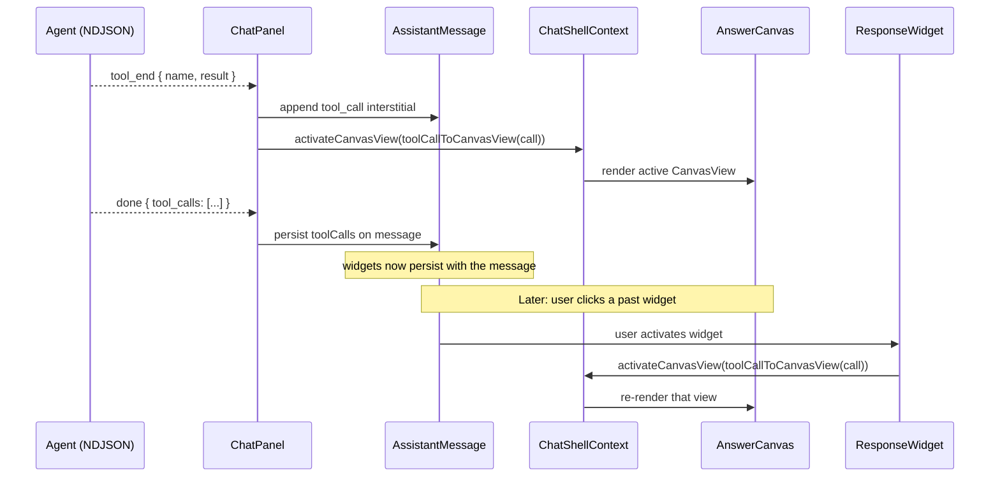

# Design Document: Dashboard UX Redesign

## Overview

The Reogent dashboard becomes a dual-mode workspace that unifies reogent's agentic chat with reoditetools' standalone tools behind a single persisted toggle.

- **AI Mode (default)** — three regions side by side on wide screens: a left **Session List**, a center **Chat Surface**, and a right **Answer Canvas**. The agent drives the Answer Canvas live as it responds; every tool it invokes is mirrored as a **Response Widget** — a clickable summary card embedded in that response message. Activating any past widget reloads its view into the canvas, so the conversation history is a replayable timeline of every view the agent ever showed. The canvas defaults to an idle campus map before the first widget.
- **Tools Mode** — chat is absent. The left sidebar becomes a **Tool List**; the selected tool renders **Full-Bleed** across the area that AI Mode splits into chat + canvas.

The design leans on three existing pieces so no new persistence or protocol is needed. (a) `message.toolCalls` already stores every tool invocation with its result and survives reloads — that *is* the widget data source. (b) `ToolCallsView` + per-tool renderers in `tool-renderers.tsx` already emit per-call cards and already open panes via `setActiveChannel`/`showOnMap` — the widget is a refinement of this, not a new surface. (c) `mergeMapHighlights(toolCalls)` is today's client heuristic that auto-opens the map after a response; this generalizes to a `toolCallToCanvasView` mapper covering course/prereq/calendar too.

Net effect: the vanishing-rail/no-close bug disappears (the canvas is persistent, the widgets are the navigation), the map gets the prominence a map-first product needs, the old `previousUserChannel` sessionStorage restore flow is retired (widgets in persisted chat history replace it), and the two products become one app behind one toggle.

## Architecture

### Region model

```mermaid
graph TD
    subgraph Shell["AppShell"]
        TB["TopBar<br/>brand · map entry(mobile) · theme · account"]
        LS["LeftSidebar<br/>SessionList XOR ToolList + ModeToggle"]
        WS["WorkspaceArea<br/>(mode-dependent)"]
        TB --- LS
        LS --- WS
    end

    subgraph AI["AI Mode · WorkspaceArea"]
        SL2["SessionList<br/>(history + new chat)"]
        CS["ChatSurface<br/>(messages + composer)<br/>embeds ResponseWidgets"]
        AC["AnswerCanvas<br/>(idle map OR active widget view)"]
        SL2 -.->|wide: side-by-side| CS
        CS -.->|agent drives / widget click| AC
    end

    subgraph Tools["Tools Mode · WorkspaceArea"]
        TL2["ToolList<br/>(4 tools)"]
        FBT["FullBleedTool<br/>(selected tool, full workspace)"]
        TL2 -.->|select| FBT
    end
```



### Response Widget → Answer Canvas flow



### High-level component tree (wide, AI Mode)

```
AppShell
├── TopBar
├── LeftSidebar
│   ├── SessionList            (AI Mode)  ── or ── ToolList (Tools Mode)
│   └── ModeToggle             ("AI mode" switch, footer, both modes)
└── WorkspaceArea
    ├── [AI Mode]
    │   ├── ChatSurface        (ChatPanel — messages embed ResponseWidgets)
    │   └── AnswerCanvas       (idle map | active widget's tool component)
    └── [Tools Mode]
        └── FullBleedTool      (selected tool's component, full workspace)
```

Below the wide breakpoint the Answer Canvas becomes a Top-Bar-triggered Bottom Sheet (AI Mode); the Tool List collapses to a drawer (Tools Mode). The ModeToggle stays pinned at the Left Sidebar footer across both.

## Components and Interfaces

### Component 1: ShellModeProvider / useShellMode

**Purpose**: Owns the AI/Tools mode selection, persists it, restores it.

**Interface**:

```ts
type ShellMode = "ai" | "tools";
function useShellMode(): { mode: ShellMode; setMode: (m: ShellMode) => void };
```

**Responsibilities**:
- Initialize from `localStorage["reogent.shell.mode"]`, default `"ai"`.
- Persist on change; write `document.documentElement.dataset.shellMode` for CSS-scoped styling (mirrors the `data-theme` FOUC-prevention pattern).
- Guard against SSR mismatch: the bootstrap sets the attribute pre-paint from localStorage.

### Component 2: ChatShellContext (extended state)

**Purpose**: Single source of truth for the workspace view — what the Answer Canvas / Full-Bleed Tool renders — plus mode-aware shell flags.

**Interface** (target shape; `activeChannel` generalized):

```ts
interface ChatShellState {
  mode: ShellMode;
  setMode: (m: ShellMode) => void;

  // The single "what's on the right / what fills the workspace" value.
  workspaceView: CanvasView | null;
  setWorkspaceView: (view: CanvasView | null) => void;

  // Agent/widget path: map a tool call to a canvas view and activate it.
  activateCanvasView: (call: ToolCall) => void;

  // Map convenience (preserved): camera fly + mobile sheet on agent map answers.
  showOnMap: (highlight: MapHighlight) => void;
  highlight: MapHighlight | null;
  mapOpen: boolean;
  focusNonce: number;

  // Below-wide Answer Canvas sheet.
  answerSheetOpen: boolean;
  setAnswerSheetOpen: (open: boolean) => void;

  // Existing session-sidebar fields preserved.
  sidebarOpen: boolean; setSidebarOpen: (open: boolean) => void;
  sessions: SessionSummary[]; sessionsLoading: boolean; sessionsError: string | null;
  refreshSessions: () => void;
  addOptimisticSession: (id: string, title: string) => void;
  renameSessionLocally: (id: string, title: string) => void;
  removeSessionLocally: (id: string) => void;
  newChatNonce: number; startNewChat: () => void;
}
```

**Responsibilities**:
- Hold `workspaceView` with a latest-value ref (same stability pattern as the existing `activeChannelRef`) so `activateCanvasView` stays identity-stable.
- `activateCanvasView(call)` resolves `toolCallToCanvasView(call)`; non-null replaces `workspaceView`; null leaves the current view (no canvas change for unmapped tools).
- `showOnMap(highlight)` = `setWorkspaceView({ paneId: "map", state: { highlight } })` + `focusNonce++` + open the below-wide sheet — preserves the existing contract.
- **Retires** `previousUserChannel` / `setPreviousUserChannel` / the `'reogent.pane.previousUserChannel'` sessionStorage flow and the `PanePreempt` Back-to pill: widgets in the persisted chat history replace the restore mechanism.

### Component 3: AppShell (refactored)

**Purpose**: Composes TopBar + LeftSidebar + WorkspaceArea; gates auth; manages `inert` on overlays.

**Responsibilities**:
- Render `RequireAuth` then the three regions.
- On below-wide AI Mode, mount `AnswerSheet` (a Bottom Sheet) instead of an inline Answer Canvas; inert the shell behind it.
- Skip-link target stays `#main-content` on the Chat Surface in AI Mode and on the Full-Bleed Tool in Tools Mode.

### Component 4: TopBar

**Purpose**: Persistent header across both modes.

**Responsibilities**:
- Brand link, theme toggle, account menu (unchanged).
- AI Mode below wide: a single "Map" entry that opens `answerSheetOpen`. Shows a cue dot when `highlight` is set and the sheet is closed (waiting answer).
- Tools Mode: no chat/new-conversation entry.
- Height is a single fixed value across all states.

### Component 5: LeftSidebar / SessionList / ToolList / ModeToggle

**Purpose**: The persistent left column; contents swap by mode; the toggle pins to the footer.

**Interface**:

```ts
function LeftSidebar() {
  // wide: inline column (existing sessions-aside slot)
  // below wide: drawer triggered from TopBar menu button
  // contents: mode === "ai" ? <SessionList/> : <ToolList/>
  // footer: <ModeToggle/>
}
```

**Responsibilities**:
- `SessionList` (AI Mode) — reuse the existing `SessionSidebar` body (history list, new-conversation, optimistic ops) without the footer tool grid; that grid is removed (manual tool launch lives in Tools Mode).
- `ToolList` (Tools Mode) — one row per `PANE_REGISTRY` entry (Course Lookup, Prereq Tree, Calendar, Campus Map); selecting a row calls `setWorkspaceView({ paneId, state: entry.defaultState })`. The Map row is the same map tool as the others (no longer special-cased as a pane that competes with chat).
- `ModeToggle` — a segmented "AI mode" switch at the footer; calls `setMode`; persisted by `useShellMode`; visible at all viewports in both modes.
- Reuses the existing wide/below-wide sidebar collapse (17 rem ⇄ 3.75 rem) and the below-wide drawer pattern.

### Component 6: ChatSurface (reused ChatPanel)

**Purpose**: The conversation + composer. Largely unchanged; one behavioral change.

**Responsibilities**:
- Reuse message rendering, streaming, composer, citation chips, session load/save.
- **Generalize the post-response canvas drive**: replace `mergeMapHighlights(response.tool_calls)` + `showOnMap`/`setActiveChannel(null)` at `chat-panel.tsx:456-460` with `activateCanvasView` over the *last* tool call that maps to a view (not just map tools). On "no mapped tool," do NOT collapse the canvas — leave the prior view (Requirement 3.6: the agent's prior view stays reachable; the canvas is persistent, not auto-closed).
- On session load, re-activate the latest widget's view from the last assistant `toolCalls` (Requirement 3.8) instead of the old `mergeMapHighlights` map-only restore at `chat-panel.tsx:289-293`.

### Component 7: AnswerCanvas

**Purpose**: The AI Mode right region. Renders the idle map or the active widget's pane component.

**Interface**:

```ts
function AnswerCanvas({ view }: { view: CanvasView | null }) {
  // view === null → <AnswerCanvasIdle/> (idle map overview, no highlight)
  // view !== null → <ActiveCanvasView view={view}/>
}
function ActiveCanvasView({ view }: { view: CanvasView }) {
  // resolve PANE_BY_ID[view.paneId], render <entry.Component state={view.state} setState={roundtrip}/>
  // for paneId === "map": read highlight from view.state; trigger focusNonce already handled on set.
}
```

**Responsibilities**:
- Idle state = `MapArea` with `highlight = null` at a default extent (map-first default).
- Active state renders the selected pane's `Component` with the widget's `state`.
- **Fixes the existing no-op `setState` bug** (`pane-host.tsx:11` passes `noopSetState`): the canvas passes a real `setState` that writes back into `workspaceView.state`, so course-lookup submit and calendar month-nav persist the canvas view instead of hitting a no-op. This is required for widgets to remain useful after the user interacts.
- Desktop: persistent (no close control — switching is via widgets). Below wide: rendered inside `AnswerSheet` which has a Close Control.

### Component 8: FullBleedTool (Tools Mode)

**Purpose**: Render the selected tool across the entire workspace area.

**Interface**:

```ts
function FullBleedTool({ view }: { view: CanvasView | null }) {
  // view === null → default to map overview
  // else render entry.Component full-bleed with real setState round-trip
}
```

**Responsibilities**:
- Fills the area AI Mode splits into chat + canvas (full width + height).
- Reuses the same `entry.Component` instances — tool components must render correctly at full width (they already are width-responsive; the prereq-tree React Flow canvas and the map fill their container, the calendar and course-lookup are flex/rooted).
- Default selection on entering Tools Mode (no prior selection) = the first `PANE_REGISTRY` entry (Campus Map), matching the map-first default.
- Exactly one tool rendered at once; selecting another replaces it.

### Component 9: ResponseWidget

**Purpose**: The inline clickable summary card embedded in an assistant message, one per `toolCall`. Activating it loads its view into the Answer Canvas.

**Interface**:

```ts
function ResponseWidget({ call }: { call: ToolCall }) {
  const view = toolCallToCanvasView(call);              // null for unmapped tools
  const { activateCanvasView, workspaceView } = useChatShell();
  const active = view && workspaceView && view.paneId === workspaceView.paneId && shallowEq(view.state, workspaceView.state);
  // summary renderer reused from existing tool-renderers (ToolBadge + per-tool summary)
  // onClick: view ? activateCanvasView(call) : no-op
}
```

**Responsibilities**:
- Reuses the existing per-tool renderers in `tool-renderers.tsx` for the summary visual (icon, label, short result summary) — no new per-tool card designs.
- `active` ring highlight when its view matches `workspaceView`.
- Keyboard-activatable (`role="button"`, `tabIndex=0`, Enter/Space) when `view` is non-null; static (non-focusable summary) when `view === null`.
- **Unifies streaming + history**: render the same `ResponseWidget` whether the call is mid-stream (from the `interstitial` block) or finalized (from `message.toolCalls`). The current split — `ToolCallBlock` while streaming vs `ToolCallsView` on history reload — collapses into one component.

### Component 10: toolCallToCanvasView mapper

**Purpose**: Generalizes `mergeMapHighlights` to all four tools. The "agent drives the canvas" policy, in one pure function.

**Interface**:

```ts
type CanvasView = { paneId: PaneId; state: PaneState };
function toolCallToCanvasView(call: ToolCall): CanvasView | null;
```

**Mapping** (derived from the research in §5 of the requirements research notes):

| `call.name` | → `paneId` | → `state` | Source of the transform |
|---|---|---|---|
| `walking_distance` | `map` | `{ highlight: extractWalkingHighlight(call) }` | existing `walking.ts:53` |
| `find_places` | `map` | `{ highlight: extractPlacesHighlight(call) }` | existing `walking.ts:98` |
| `find_building` | `map` | `{ highlight: extractBuildingHighlight(call) }` | existing `walking.ts:76` |
| `find_parking` | `map` | `{ highlight: extractPlacesHighlight(call) }` (adapter) | existing family |
| `get_course` / `search_courses` | `course-lookup` | `{ code: result.code ?? input.code ?? input.subject }` | `courses.ts` result shape |
| `get_prereq_tree` | `prereq-tree` | `{ root: result.rootCode ?? input.code, selections: {} }` | `build-graph.ts:35`; mirrors `tool-renderers.tsx:104` |
| `get_key_dates` | `calendar` | `{ cursor: thisMonth(), kinds: ["academic","holiday"] }` | `calendar.ts:4` |
| (error result) | — | `null` | `isToolError` filter |
| (unmapped) | — | `null` | no canvas view; widget renders static summary |

**Responsibilities**:
- Pure function; the table is its entire logic. Trivial to test (example-based over the table rows).
- Error results return `null` (no canvas change; requirement 3.7 fallback).
- `walking_distance` deliberately keeps the polyline out of `tool_calls.result` (the map re-fetches it from `/api/route`); the mapper passes only the `WalkingHighlight`, and `CampusMap` fetches the polyline as it does today.

## Data Models

### Model 1: ShellMode

```ts
type ShellMode = "ai" | "tools";
```

**Validation**: the persisted string in `localStorage["reogent.shell.mode"]` must be `"ai"` or `"tools"`; any other value (or absence) falls back to `"ai"`.

### Model 2: CanvasView

```ts
type CanvasView = { paneId: PaneId; state: PaneState };
// PaneId = "map" | "course-lookup" | "prereq-tree" | "calendar"
// PaneState = Record<string, unknown>  (existing)
```

**Validation**:
- `paneId` must exist in `PANE_BY_ID`.
- `state` must satisfy the target pane's expected keys (see the table in §5c of the research notes): `map` reads `state.highlight` (optional), `course-lookup` reads `state.code`, `prereq-tree` reads `state.root`, `calendar` reads `state.cursor` / `state.kinds`. Missing keys fall back to the pane's `defaultState` (existing behavior).

### Model 3: WorkspaceView

Same shape as `CanvasView | null`. `null` means "idle" — AI Mode shows the idle map; Tools Mode falls back to its default tool. Held by `ChatShellContext.workspaceView`.

### Model 4: ToolCall (unchanged, reused)

```ts
interface ToolCall { name: string; input: Record<string, unknown>; result?: unknown; }
```

No new persisted field. The Response Widget is a render of `ToolCall`; `message.toolCalls` remains the persisted widget data source.

### Model 5: ResponseWidget artifact (derived, not persisted)

The widget is not a stored entity. It is `{ call: ToolCall; view: CanvasView | null; active: boolean }`, derived at render time from `message.toolCalls` + `toolCallToCanvasView` + `workspaceView`. Nothing new is written to the DB.

## Error Handling

### Error Scenario 1: Tool result cannot render in the canvas

**Condition**: `toolCallToCanvasView(call)` returns `null` (unmapped tool, or a result with `status: "error"`).
**Response**: The ResponseWidget still renders as a static summary card with the tool's badge and short result text; it is not keyboard-focusable and does not activate the canvas. The Answer Canvas is unchanged (no auto-close — the canvas is persistent).
**Recovery**: None needed; the user continues chatting. If a later tool in the same turn maps, that widget activates the canvas.

### Error Scenario 2: An agent tool errors mid-stream

**Condition**: `tool_end` carries `result = { status: "error"; message }`.
**Response**: The widget renders the error summary; `toolCallToCanvasView` returns `null`; no canvas change. The existing retry/stopped banner behavior (`chat-panel.tsx:464-501`) is preserved.
**Recovery**: The user retries; on a successful retry the new widget activates the canvas normally.

### Error Scenario 3: Mode-toggle state loss across a boundary

**Condition**: The viewport crosses a breakpoint while the user is mid-view.
**Response**: `workspaceView`, `mode`, and the current session are preserved (Requirement 7.1). Only the layout arranges for the new viewport; the active view is not reset. Map camera/highlights live in `CampusMap` ref state and are not remounted on breakpoint change (the shell does not unmount the canvas across breakpoints).
**Recovery**: N/A — no recovery needed; this is the invariant.

### Error Scenario 4: Map state loss across a session swap

**Condition**: The user switches conversations (`/chat/[session_id]`); React remounts `ChatPanel` (keyed by session).
**Response**: `workspaceView` re-activates the latest widget of the new session (Requirement 9.4 / 3.8). `MapArea` is hosted in `AppShell` (not inside `ChatPanel`), so it is not remounted on session swap; the camera and layer state survive. The active highlight updates from the new session's latest widget.
**Recovery**: N/A — the architecture prevents the loss rather than recovering from it.

### Error Scenario 5: Stale `setState` no-op (existing bug, now fixed)

**Condition**: Previously `pane-host.tsx:11` passed `noopSetState`, so course-lookup submit and calendar month-nav wrote into a no-op and the user's in-canvas interaction was lost on any re-render.
**Response**: `AnswerCanvas` / `FullBleedTool` pass a real `setState` that merges back into `workspaceView.state`, so in-canvas interactions persist.
**Recovery**: N/A — this is a correctness fix, not a runtime error.

## Testing Strategy

This is a UI-rendering feature. Property-based testing does not apply (the workflow excludes UI rendering from PBT). The strategy is example-based unit + component + integration tests, plus snapshot tests for layout.

### Unit Testing Approach

- `toolCallToCanvasView` — example-based over every row of the mapping table: one passing case + one error-result case per tool name. Covers unmapped tools returning `null`. The smallest test that fails if the mapping breaks.
- `useShellMode` — default `"ai"`; reads and writes `localStorage["reogent.shell.mode"]`; restores on remount; rejects invalid persisted values.
- `shallowEq` for `workspaceView.state` matching (widget `active` ring).

### Component Testing Approach (happy-dom + @testing-library/react)

- `ModeToggle` — toggling swaps `LeftSidebar` contents between SessionList and ToolList and persists.
- `AnswerCanvas` — renders `AnswerCanvasIdle` (idle map) when `workspaceView === null`; renders the pane's component for a given `CanvasView`.
- `ResponseWidget` — renders from a `ToolCall`; click activates the canvas for mapped tools; non-mapped tools render static and non-focusable; `active` ring reflects `workspaceView`.
- `FullBleedTool` — renders the selected pane full-bleed; selecting another replaces it.
- The stable-callback regression test added in the pane-open fix (`pane-shell.test.tsx`) is preserved for the `activateCanvasView` stability contract.
- Snapshot: AppShell wide AI Mode, AI Mode below wide (sheet), Tools Mode, Tools Mode below wide (drawer) — baseline for layout regressions.

### Integration Testing Approach

- Agent stream → canvas: drive `runExchange` with a fake NDJSON stream containing a `tool_end`/`done` for each mapped tool; assert `workspaceView` becomes the expected `CanvasView` after `done`.
- Reload re-activation: seed `getSession` with a history whose last assistant message has `toolCalls`; assert `workspaceView` re-activates that tool's view on mount (Requirement 3.8).
- Revisit: render two assistant messages with widgets; activate the earlier widget; assert `workspaceView` switches to it.
- A11y: keyboard activation of a widget moves focus and loads the canvas; closing the below-wide sheet returns focus to the Map entry.

## Performance Considerations

- `MapArea` stays mounted in `AppShell` across session swaps and breakpoint changes (not inside `ChatPanel`) so the deck.gl scene, map tiles, and camera are never rebuilt. This is the existing intent; the redesign makes it structural.
- Per-tool pane components are lazy-loaded (`React.lazy`) so a mode that never touches the prereq-tree React Flow bundle doesn't pay for it.
- `toolCallToCanvasView` is pure and cheap; calling it per render of each widget is negligible. The `active` ring compares `workspaceView.state` with a shallow equal — bounded by the small pane-state keys, not the tool result size.
- The existing rAF-batched text streaming (`chat-panel.tsx:426-436`) is preserved; widgets render from `interstitial`/`toolCalls` updates that already debounce.
- No new network calls: `walking_distance` keeps the existing `/api/route` polyline fetch; no widget adds round-trips.

## Security Considerations

- No new trust boundary. Tool results rendered in widgets are the same server-validated `ToolCall.result` payloads already rendered by `ToolCallsView`; the redesign only adds an `onClick` that calls an in-app state setter, not a URL navigation.
- Markdown remains `skipHtml` (`message.tsx:44`); widget summaries never inject raw HTML.
- `localStorage["reogent.shell.mode"]` is user-local preference, not auth or session data; tolerant parse, no sensitive surface.
- Mode toggle does not bypass `RequireAuth`: both modes sit behind the existing auth gate.

## Dependencies

No new external dependencies. The redesign composes existing pieces:

- `react-markdown` + `remark-gfm` — unchanged.
- `motion/react` — existing region/sheet animations reused.
- `maplibre-gl` + `@deck.gl/*` — Map surface unchanged.
- `reactflow` — prereq-tree pane unchanged.
- Existing tool components (`CourseLookupPane`, `PrereqTreePane`, `CalendarPane`, `MapArea`) reused as-is; only their host wrapper changes (`AnswerCanvas` / `FullBleedTool`).

**Retired code** (removed in the tasks phase): `PaneHost` (replaced by `AnswerCanvas`), `ToolsStrip` rail (replaced by `ToolList` in Tools Mode and by widgets in AI Mode), `PanePreempt` + the Back-to pill + `previousUserChannel`/sessionStorage flow (replaced by widgets), the composer `+` tools menu in AI Mode (manual tool launch moves to Tools Mode), and `mergeMapHighlights` (replaced by `toolCallToCanvasView`).
